 

  

 

## Fala parceiro(a)! Suave?

meu nome é Gustavo Cintra, Startup's Founder e  Software Engineer. Construo sistemas com IA no centro do processo: parto de um problema real, monto a primeira versão rápido e coloco no ar para ver [...]

Penso primeiro em problema, cliente e distribuição, e só depois em tela. A IA entrega a velocidade, e eu cuido da decisão sobre o que construir e para quem.

| Founder | Software engineer com IA | Música |
|:-:|:-:|:-:|
| Produto, cliente e distribuição | Do protótipo ao deploy com agentes de código | Trilha sonora de toda sessão |

 

## Como eu construo:

## O que acontece em cada etapa:

 

| | Etapa | O que acontece |
|:-:|:--|:--|
| **01** | **Problema** | Defino quem sofre, quanto isso custa e qual é o menor produto que resolve. |
| **02** | **Protótipo** | No Lovable transformo o briefing em interface navegável. |
| **03** | **Dados** | No Supabase ficam banco, login e regras de acesso. |
| **04** | **Refino** | No Claude Code reviso, corrijo e evoluo o produto. |
| **05** | **Deploy** | Publico, acompanho o uso e volto à etapa 01 com dados reais. |

 

## Estou disponível:
 

| Sites e landing pages | Produtos com IA | Parcerias |
|:-:|:-:|:-:|
| Páginas que captam clientes | MVPs do problema ao deploy | Founders e negócios com ideia pronta |

 

